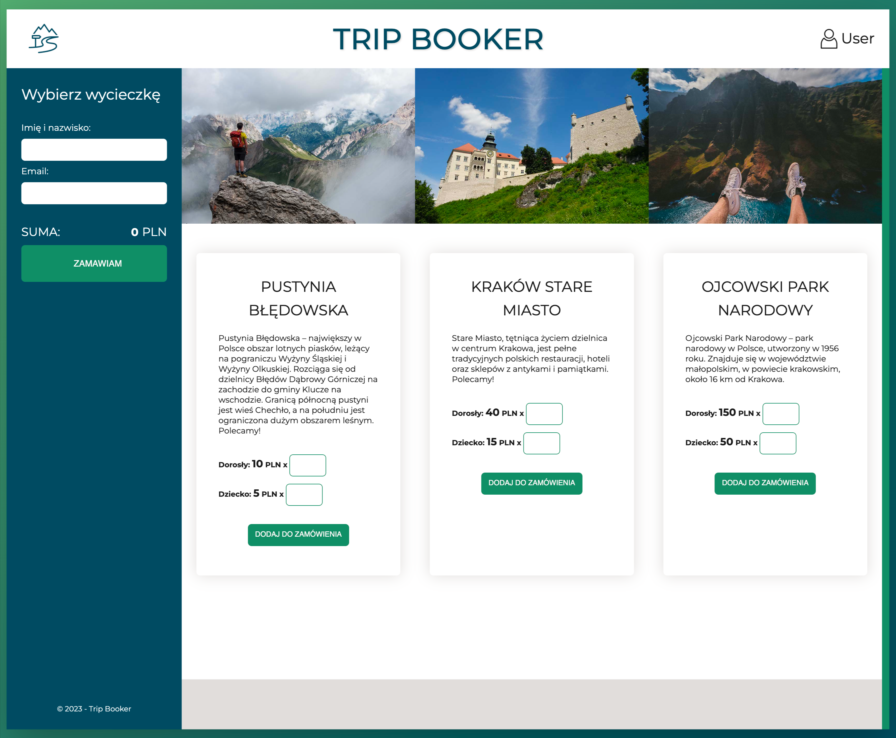
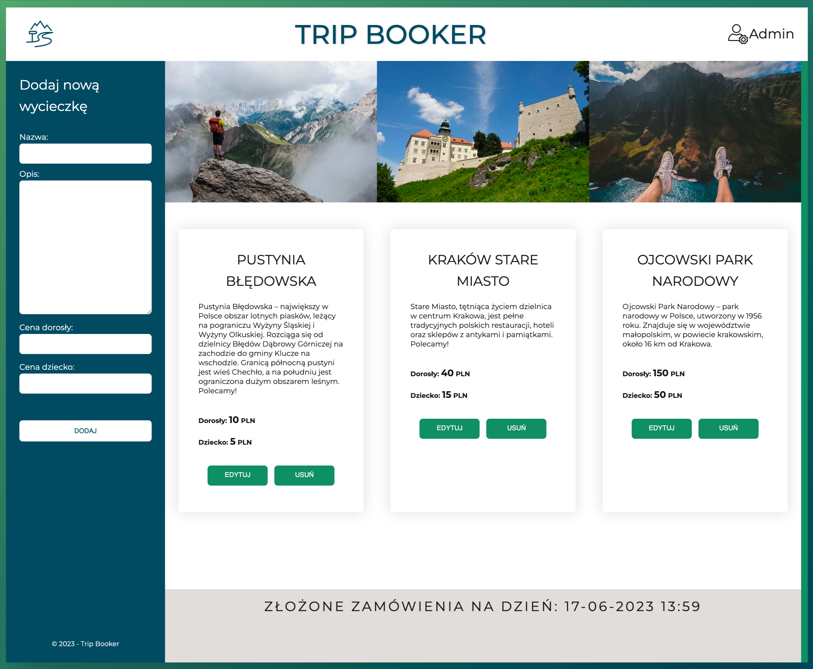

# TRIP BOOKER

<div style="display: flex;">
  <div style="width: 50%;">
    
  </div>
  <div style="width: 50%;">
    
  </div>
</div>

&nbsp;

## 🔍 Overview

### What is TRIP BOOKER?

Application made as one of the mini projects while learning on the Frontend course. It allows to order trips by users and manage the offer of available trips by the administrator.
Project is still in development.

### TRIP BOOKER features

#### Client site

- **add trips** to the basket
- **preview of the basket** (**updated** cost and list of added trips)
- **remove trips** from the basket
- **place an order** - after completing the form and form validation the order is added to the database - API launched using JSON Server

#### Admin site

- **panel for managing trips (add/remove/edit)** saved in the database (API launched using JSON Server)
- data added after validation

&nbsp;

## 👨‍💻 Built with


&nbsp;

## ⚙️ Run Locally

The project uses [node](https://nodejs.org/en/), [npm](https://www.npmjs.com/) and [JSON server](https://www.npmjs.com/package/json-server), follow the steps below to run it locally.

- Clone the project using

```bash
  git clone
```

- Go to the project directory and install dependencies

```bash
  npm i
```

- Start developers mode

```bash
  npm start
```

- Start JSON server

```bash
  json-server ./data/excursions.json
```

- Trip Booking App is ready to go:

  - client site

    ```bash
    http://localhost:8080/
    ```

  - admin site

    ```bash
    http://localhost:8080/admin.html
    ```

&nbsp;

## 💭 Conclusions for future of this project

- In future I would like to improve presentation of errors/notification.
- Add login options.
- Add database connection.

&nbsp;

## 🙏 Special thanks

Special thanks to my [Mentor - devmentor.pl](https://devmentor.pl/) for providing me with the task.
